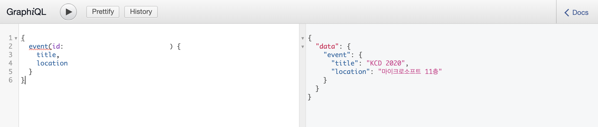
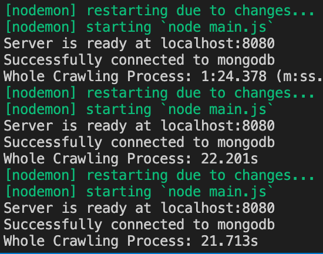
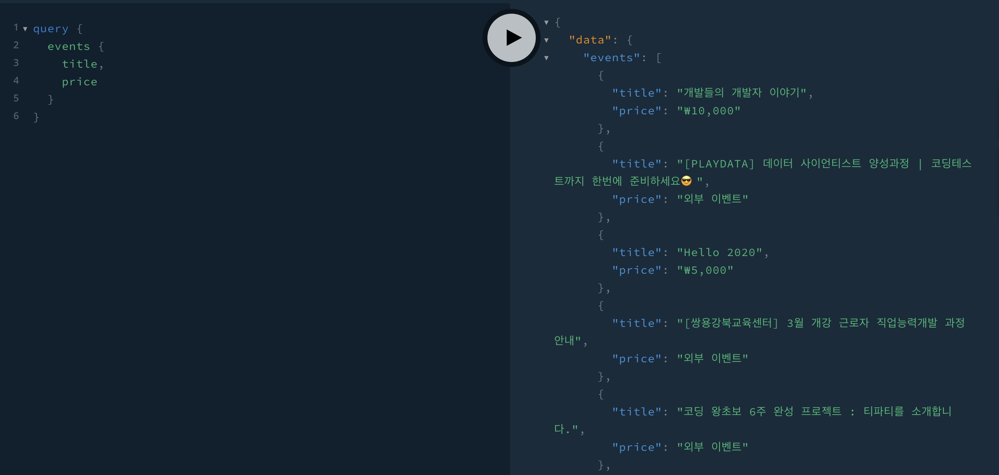

# Backend for DevEvents

This website lets people know what events related to developers are held every month.

## 👪 Contributor(s)

Everyone can open an issue or pull request anytime.

- [🔗Unperknown](https://github.com/Unperknown)

## 🔑 Technology Stacks

## API Documentation

[🔗]()

## Daily Progress

### 2/13 - GraphQL CRUD 설정하기

GraphQL와 MongoDB를 연동하였다.

### 2/14 ~ 2/15 - 웹 크롤링 구현

개발 행사 사이트의 데이터를 크롤링하여 저장될 수 있도록 하였다.

Cons
- 크롤링의 전체 플로우에서 메모리 누수가 되지 않도록, 그리고 실행하는 데 러닝타임을 줄일 수 있도록 리팩토링해야 한다.

### 2/16 ~ 2/18 - 웹 크롤링 유지 보수

Cluster를 활용하여 크롤링의 러닝 타임을 줄이고 기존에 여러 브라우저를 실행하는 과정에서 한 브라우저에서 여러 페이지를 렌더링하며 크롤링할 수 있도록 하였다.

Pros
- 크롤링의 러닝 타임을 3배 이상 줄일 수 있었다.
- 하나의 프로세스에서 처리할 수 있도록 하여 메모리 사용을 최대한 줄일 수 있었다.

Cons
- 크롤링 API에 대해서 엔드포인트, 예외 처리를 추가적으로 구현해야 한다.

### 2/19 ~ 2/20 - Apollo Server 적용

Apollo Server를 적용하여 유연한 쿼리 및 뮤테이션이 이루어질 수 있도록 하였다.

