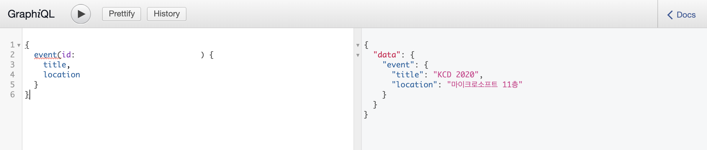

# Backend for DevEvents

This website lets people know what events related to developers are held every month.

## 👪 Contributor(s)

Everyone can open an issue or pull request anytime.

- [🔗Unperknown](https://github.com/Unperknown)

## 🔑 Technology Stacks

## API Documentation

[🔗]()

## Daily Progress

### 2/13 - GraphQL CRUD 설정하기

GraphQL와 MongoDB와의 연동하였다.

